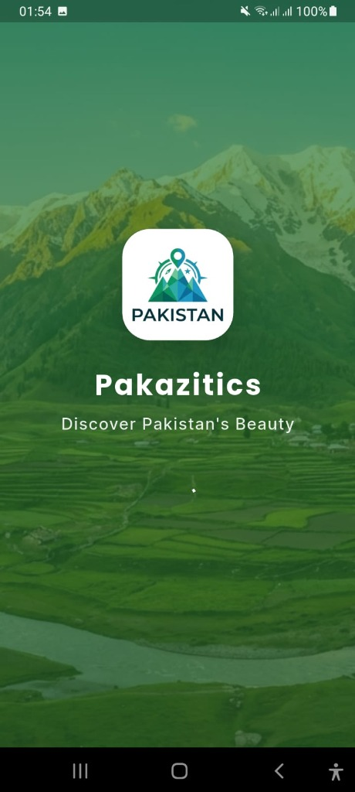
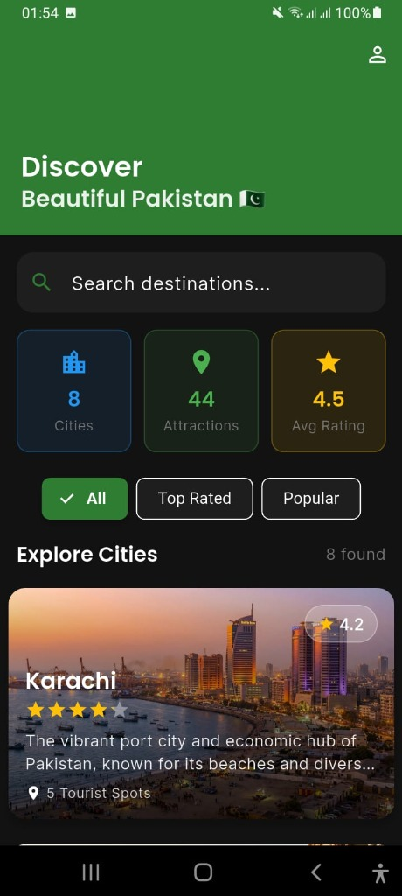
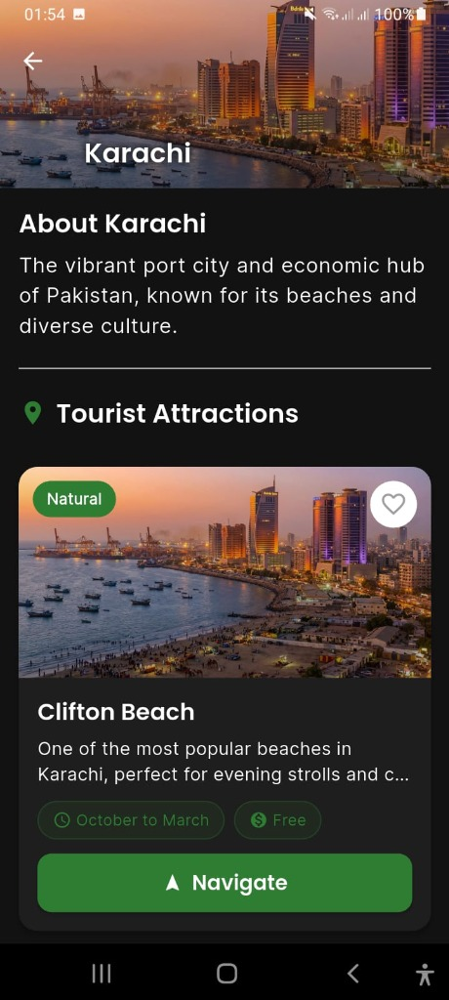
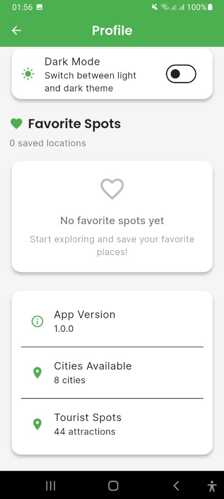

# 🇵🇰 Pakazitics - Discover Pakistan


**Pakazitics** is a modern Flutter application designed to help tourists and locals discover the beautiful cities and attractions of Pakistan. With a sleek user interface, real-time navigation, and comprehensive city guides, exploring Pakistan has never been easier.

---

## 📱 Screenshots

| **Splash Screen** | **Home Screen** |
|:---:|:---:|
|  |  |

| **City Details** | **Profile & Settings** |
|:---:|:---:|
|  |  |

---

## ✨ Features

- **🏙️ Explore Cities**: Browse through a curated list of major cities in Pakistan with detailed descriptions.
- **📍 Tourist Spots**: Discover popular tourist attractions within each city.
- **🗺️ Interactive Maps**: View spots on an interactive map powered by OpenStreetMap.
- **🧭 Real-time Navigation**: Get distance, estimated travel time, and turn-by-turn navigation to your destination.
- **🔍 Smart Search**: Easily find cities and attractions with a powerful search bar.
- **🏷️ Filters**: Sort destinations by "Top Rated" or "Popular" to find the best spots.
- **🌙 Dark Mode**: Seamlessly switch between light and dark themes for a comfortable viewing experience.
- **📱 Responsive Design**: Optimized for both mobile and tablet devices.

---

## 📥 Download APK

You can download the latest version of the app from our GitHub Releases page:

<p align="center">
  <a href="https://github.com/HaroonRafiqueDev/pakazitics/releases/tag/tour">
    
  </a>
</p>

> **Note:** Click the button above to visit the release page, then look for the **Assets** section to download the `.apk` file.

---

## 🛠️ Tech Stack

- **Framework**: [Flutter](https://flutter.dev/)
- **Language**: [Dart](https://dart.dev/)
- **Maps**: [flutter_map](https://pub.dev/packages/flutter_map), [latlong2](https://pub.dev/packages/latlong2)
- **Location**: [geolocator](https://pub.dev/packages/geolocator)
- **State Management**: [Provider](https://pub.dev/packages/provider)
- **Storage**: [shared_preferences](https://pub.dev/packages/shared_preferences)
- **UI/UX**: Custom Theming, Animations, Glassmorphism

---

## 🚀 Getting Started

To run this project locally:

1.  **Clone the repository**:
    ```bash
    git clone https://github.com/yourusername/pakazitics.git
    ```

2.  **Navigate to the project directory**:
    ```bash
    cd pakazitics
    ```

3.  **Install dependencies**:
    ```bash
    flutter pub get
    ```

4.  **Run the app**:
    ```bash
    flutter run
    ```

---

## 🤝 Contributing

Contributions are welcome! If you have any suggestions or find a bug, please open an issue or submit a pull request.

---

## 📄 License

This project is licensed under the MIT License - see the [LICENSE](LICENSE) file for details.

---

Made with ❤️ in Pakistan 🇵🇰
